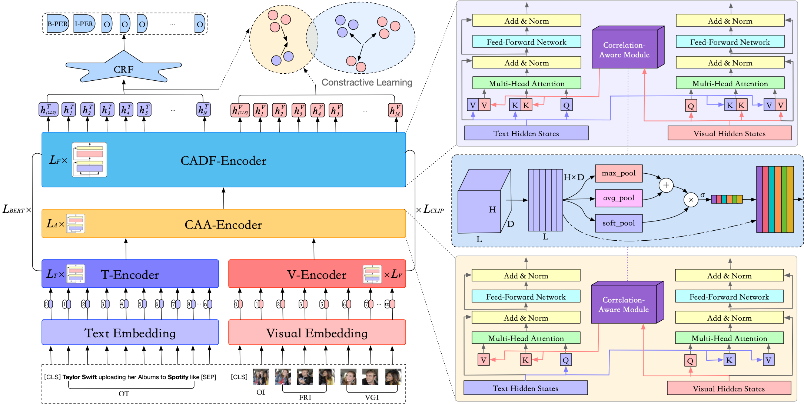

# Source Code of VEC-MNER Model for Multimodal Named Entity Recognition
Implementation of Our Paper "[VEC-MNER: Hybrid Transformer with Visual-Enhanced Cross-Modal Multi-level Interaction for Multimodal NER]" in ACM ICMR 2024. This Implementation is based on the [DeepKE](https://github.com/zjunlp/DeepKE).

## Model Architecture


The Overall Framework of Our Proposed VEC-MNER Model. We propose a new homogeneous Hybrid Transformer Architecture, which naturally reduces the heterogeneity. Moreover, we design the Correlation-Aware Alignment (CAA-Encoder) layer and the Correlation-Aware Deep Fusion (CADF-Encoder) layer, combined with contrastive learning, to achieve more effective implicit alignment and deep semantic fusion between modalities, respectively. We also construct a Correlation-Aware (CA) module that can effectively reduce heterogeneity between modalities and alleviate visual deviation. Experimental results demonstrate that our approach achieves SOTA performance, achieving $74.89\%$ and $87.51\%$ F1-score on Twitter-2015 and Twitter-2017, respectively.

## Installation
Clone the newest repository:

```bash
git clone https://github.com/wpfnlp/VEC-MNER
cd VEC-MNER/example/ner/multimodal
```

Install with Pip

```bash
pip install -r requirements.txt
python setup.py install
```

## Usage
#### Dataset - Twitter2015 & Twitter2017
- Download the dataset to this directory.
    
  The text data follows the conll format.
  The acquisition of Twitter15 and Twitter17 data refer to the code from [UMT](https://github.com/jefferyYu/UMT/), many thanks.
    
  You can download the Twitter2015 and Twitter2017 dataset with detected visual objects using folloing command:
    
  ```bash
  wget 120.27.214.45/Data/ner/multimodal/data.tar.gz
  tar -xzvf data.tar.gz
  ```
- The twitter15 dataset with detected visual objects is stored in `data`:
    
  - `twitter15_detect`：Detected objects using RCNN
  - `twitter2015_aux_images`：Detected objects using visual grouding
  - `twitter2015_images`： Original images
  - `train.txt`: Train set
  - `...`
#### Training
- Parameters, model paths and configuration for training are in the `conf` folder and users can modify them before training.
- Download the [PLM](https://huggingface.co/openai/clip-vit-base-patch32/tree/main) and set `vit_name` in `train.yaml` and `predict.yaml` as the directory of the PLM.
- Run
    
  ```bash
  python run.py
  ```
- The trained model is stored in the `checkpoint` directory by default and you can change it by modifying "save_path" in `train.yaml`.
- Start to train from last-trained model `<br>`
    
  modify `load_path` in `train.yaml` as the path of the last-trained model
- Logs for training are stored in the current directory by default and the path can be configured by modifying `log_dir` in `.yaml`
#### Prediction
Modify "load_path" in `predict.yaml` to the trained model path. 
<!-- **In addition, we provide [the model trained on Twitter2017 dataset](https://drive.google.com/drive/folders/1ZGbX9IiNU3cLZtt4U8oc45zt0BHyElAQ?usp=sharing) for users to predict directly.** -->
  
```bash
python predict.py
```
## Cite
If you use or extend our work, please cite the following paper:
```bibtex
```
